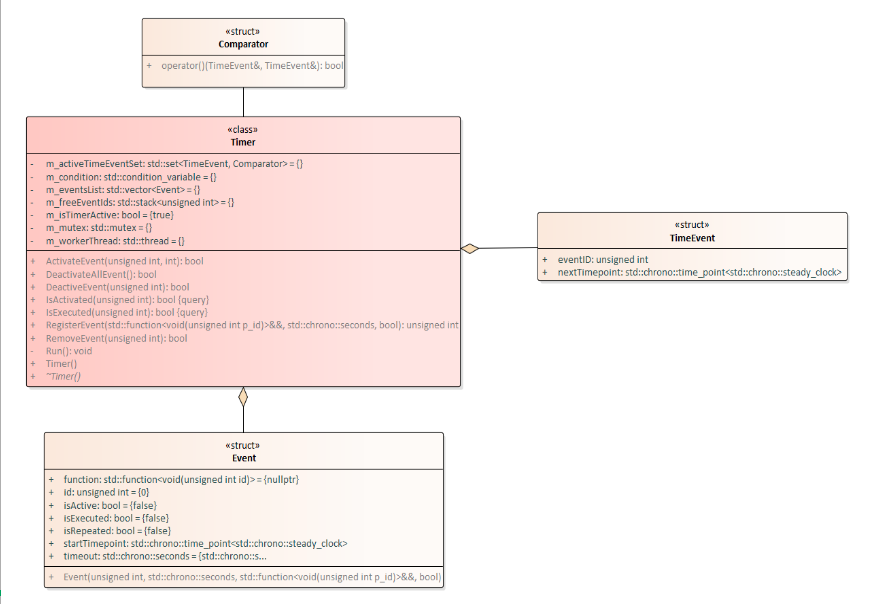

# watchcat: Yet Another Watchdog Library 
An open-source thread-safe C++11 timer exposing APIs in C++, Python2 and Java programming language. It provides a simple to use and easy to understand interface. This project does not depends on any third-party library and uses modern C++.

### Clone project
    git clone https://github.com/gmatesunny/watchcat.git

### Build library and google test    
    cd build
    cmake ..
    make

### Build APIs for Python2 and Java  
    cd swig
    bash ./generate.sh

### Run as follows
    cd build
    ./example/example
    ./test/testwatchcat/testwatchcat

### Ussage

* Adapt `libwatchcat/CMkakeLists.txt` to build to create `SHARED` or `STATIC` library as per your custom project need and then add `add_subdirectory(libwatchcat)` your root `CMkakeLists.txt` file

* It could be used as a header only library for C++11 without the need to create `SHARED` or `STATIC` library. You only need to include `libwatchcat/timer.hpp` and `libwatchcat/time.cpp` files in your custom project. 

You can see the sample use of this library in `example/main.cpp`. The client will register events as lambda functions and pass a variable as reference. This variable will be update by some other function and it will be observed by the registered event. The event will be invoked at regular intervals or only once based on the flag `isRepeated`.  
The event can be deactivated/cancelled by the client if not needed or if there is no need to observ a function. In default setting, the event will be automatically deactivated/cancelled after it is invoked one time. 

Feel free to open any topic in `Discussion` section of github for this watchcat repository.

### Project structure

<pre>
├── build
├── CMakeLists.txt
├── example
│   ├── CMakeLists.txt
│   └── main.cpp
├── libwatchcat
│   ├── CMakeLists.txt
│   ├── timer.cpp
│   └── timer.hpp
├── LICENSE
├── README.md
├── swig
│   ├── generate.sh
│   ├── main.java
│   ├── main.py
│   ├── timer.i
└── test
    ├── CMakeLists.txt
    └── testwatchcat
        ├── CMakeLists.txt
        ├── main.cpp
        ├── testwatchcat.cpp
        └── testwatchcat.hpp
</pre>

### Core design

The followng diagram shows the class UML diagram.

The events are placed in the vector datastucture. The id's and next invocation time of the events is maintained in a self ordered set. The events are executed on a worker thread instead of spawning a new theread for each invocation.
